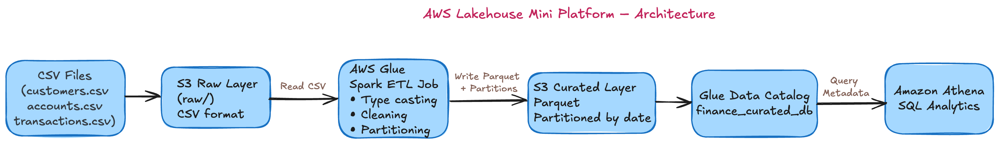

# AWS Lakehouse Architecture

## Architecture Diagram

## Data Pipeline Flow

┌─────────────────────────────────────────────────────────────────┐
│                      DATA LAKEHOUSE PIPELINE                    │
└─────────────────────────────────────────────────────────────────┘

S3 Raw Layer (Bronze)
├── customers.csv
├── accounts.csv
└── transactions.csv
│
↓

AWS Glue Crawler + Data Catalog
├── Auto-discover schema
├── Create table definitions
└── Register in Glue Catalog
│
↓

AWS Glue Spark ETL Job
├── Data cleansing
├── Deduplication (transaction_id)
├── Balance calculations (amount_signed)
├── Timestamp parsing
└── Partition by date (dt)
│
↓

S3 Curated Layer (Silver)
├── Parquet format
├── Partitioned by dt
└── Finance-grade validated data
│
↓

Amazon Athena
├── Ad-hoc SQL queries
├── Finance analytics
└── Data exploration
│
↓

Amazon Redshift
├── Reporting & BI
├── Dashboards
└── Business intelligence tools

## Layer Descriptions

### Raw Layer (Bronze)
- **Storage**: S3 bucket with CSV files
- **Purpose**: Landing zone for raw financial data
- **Format**: CSV
- **Schema**: As-is from source systems

### Curated Layer (Silver)
- **Storage**: S3 bucket with Parquet files
- **Purpose**: Cleaned, validated, enriched data
- **Format**: Parquet (columnar, compressed)
- **Partitioning**: By date (`dt`) for query optimization
- **Transformations**:
  - Deduplication by `transaction_id`
  - Type conversion (timestamp parsing)
  - Business logic (amount_signed calculation)
  - Data quality validation

### Analytics Layer
- **Athena**: Serverless SQL for interactive queries
- **Redshift**: Data warehouse for aggregated reporting

## Key AWS Services

| Service | Purpose |
|---------|---------|
| **S3** | Object storage for raw and curated data |
| **Glue Crawler** | Automatic schema discovery |
| **Glue Data Catalog** | Centralized metadata repository |
| **Glue ETL** | Spark-based data transformation |
| **Athena** | Serverless SQL query engine |
| **Redshift** | Cloud data warehouse |

## Data Quality Gates

Between raw and curated layers:
- ✓ No null `account_id`
- ✓ Positive `amount` values
- ✓ Valid `transaction_ts` format
- ✓ Unique `transaction_id`